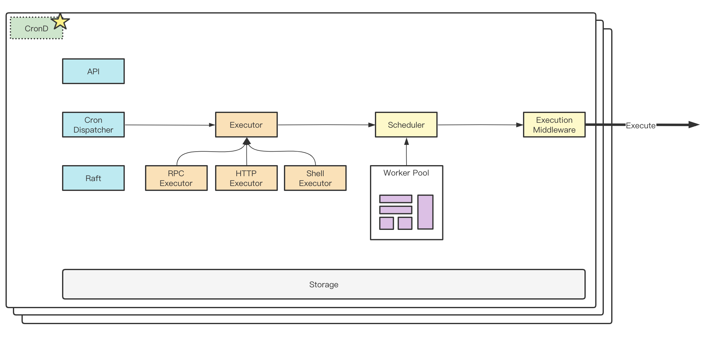

# CronD（WIP）

CronD is a **Cloud Native** golang distributed cron scheduling service.

CronD serves a distributed unified job dispatcher for offline periodic tasks. It is recommended running in
a cluster with 3 or 5 nodes, peer nodes communicate by **Raft Consensus**.

## Architecture
